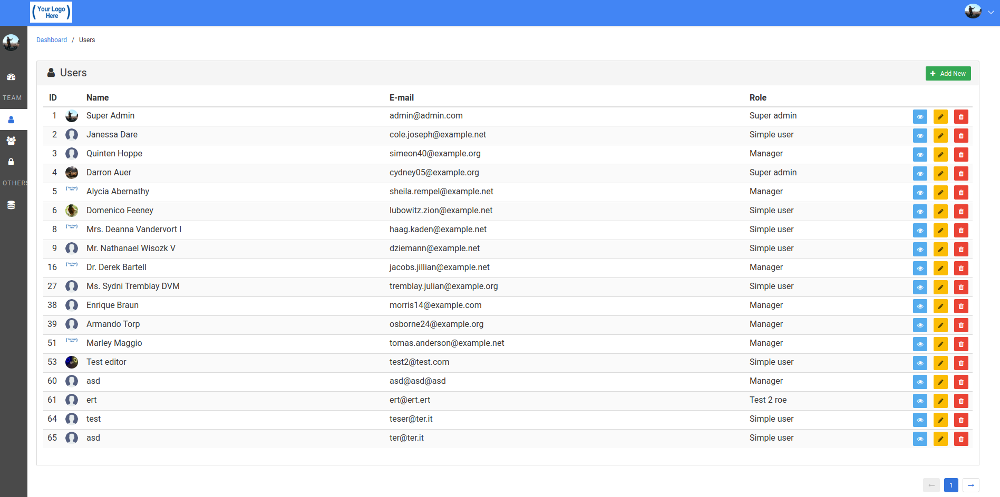

# Admin panel starter kit
A full Admin Panel to start with Laravel 5.5 and Bulma CSS.

---
## Table of Contents
  - [Features](#features)
  - [Screenshot](#screenshot)
  - [How to install](#how-to-install)
  - [Bugs and Feedback](#bugs-and-Feedback)
  - [Documentation](#documentation)
  - [License](#license)

## Features

  - [Bootstrap](https://getbootstrap.com) and [jQuery](https://jquery.com/) are no longer loaded and all referencies have been removed;
  - The default Vue preset, component and view template have been removed;
  - Responsive layout based on [Bulma CSS](https://bulma.io/) fully customizable;
  - [Beautiful theme](storage/demo_pages/screenshot.png) with sidebar menu displayed on mouse hover; 
  - [Font Awesome](http://fontawesome.io) icons loaded by default;
  - Nice breadcrumbs (thanks to [laravel-breadcrumbs](https://github.com/davejamesmiller/laravel-breadcrumbs) package);
  - Auth management with CRUD for Users, Roles and Permissions: you can assign a role to each user and one or more permissions to each role in the UI;
  - User login, registration, activation and forgot password pages;
  - User's profile with avatar;
  - ... more to come!

## Screenshot

## How to install

1.    Make sure you have [Composer](https://getcomposer.org/), [Node](https://nodejs.org/en/) and [NPM](https://www.npmjs.com/) installed on your machine.

1.    Download or clone this repository and `cd` into your app:
      
            git clone git@github.com:massiws/lara-bulma.git my-app
            cd my-app
      
1.    Install via composer: `composer install`

1.    Install dependencies and compile assets: `npm install && npm run dev`

1.    Create an empty database;

1.    Copy `.env.example` to `.env` and modify according to your environment: `cp .env.example .env`

1.    Generate the `APP_KEY`: `php artisan key:generate`

1.    Run migration with seeds: `php artisan migrate --seed`

      This creates the basic tables for Users, Roles and Permissions, with two predefined users:
      - _Admin_ (_Administrator_ role), with all granted permissions to CRUD Users, Roles and Permissions; 
      - _User_ (_Simple user_ role), with only permission to view Users, Roles and Permissions. 
        
      You can change these default settings by adding/removing permission to each role in the UI.

1.    Create a symbolic link from `public/storage` to `storage/app/public`: `php artisan storage:link`

1.    Run you local server: `php artisan serve`

1.    Login:
      - _Administrator_ user: email *admin@admin.com* - password *123456*
      - _Simple user_ user: email *user@user.com* - password *123456*

## Bugs and Feedback
For bugs, questions and discussions please use ...

## License
This boilerplate is open-sourced software licensed under the [MIT license](LICENSE).

## Documentation
  - [Laravel documentation](https://laravel.com/docs)
  - [Bulma documentation](http://bulma.io/documentation/overview/start)
  - [Demo pages](storage/demo_pages)
